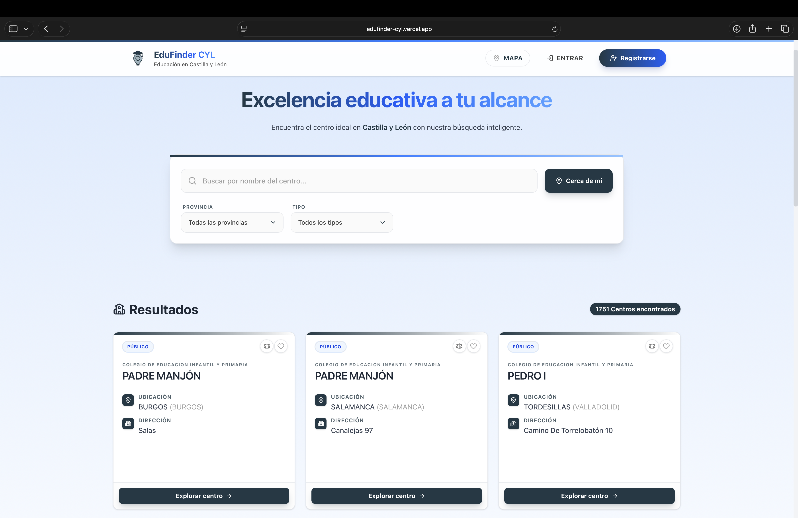
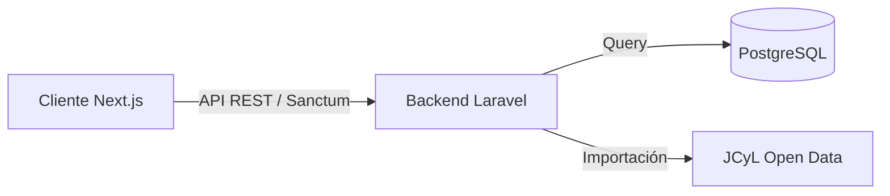

# 🎓 EduFinder CyL

<div align="center">



<!-- Badges de Tecnologías - Estilo Limpio -->
<div style="display: flex; justify-content: center; gap: 10px; flex-wrap: wrap; margin-bottom: 20px;">
  
  
  
  
  
</div>

<h3 align="center">La plataforma definitiva para la búsqueda de centros educativos y FP en Castilla y León.</h3>

<!-- Botones de Enlaces Principales - Diseño Pro -->
<p align="center">
  <a href="https://edufinder-cyl.vercel.app">
    
  </a>
  <a href="https://drive.google.com/file/d/1ljQkEfAiii0pDApF5E8khZnMtEd4Ei9_/view?usp=sharing">
    
  </a>
  <a href="https://edufinder-cyl.onrender.com">
    
  </a>
</p>

</div>

---

## 📋 Información y Misión

**EduFinder CyL** nace como respuesta a la necesidad de centralizar, visualizar y comparar la oferta educativa de **Castilla y León**. Transformamos datos públicos en una experiencia digital de primer nivel, permitiendo a estudiantes y familias tomar decisiones informadas sobre su futuro académico.

Utilizando **Open Data** de la Junta de Castilla y León, hemos creado una herramienta que no solo lista centros, sino que permite:

- Visualizarlos en un **mapa interactivo** con geolocalización.
- **Comparar** hasta 3 centros simultáneamente (oferta, titularidad, servicios).
- Guardar **favoritos** y gestionar preferencias personales.

---

## 📊 Fuentes de Datos (Open Data JCyL)

Este proyecto se nutre de los datasets oficiales proporcionados por el Portal de Datos Abiertos de la Junta de Castilla y León. Agradecemos su compromiso con la transparencia.

| Dataset                   | Enlace Oficial                                                                                                                                                                                                                                                                                                                                    | Descripción                                                  |
| :------------------------ | :------------------------------------------------------------------------------------------------------------------------------------------------------------------------------------------------------------------------------------------------------------------------------------------------------------------------------------------------ | :----------------------------------------------------------- |
| **Directorio de Centros** | [🔗 Acceder al Dataset](https://analisis.datosabiertos.jcyl.es/explore/dataset/directorio-de-centros-docentes/export/?disjunctive.denominacion_generica)                                                                                                                                                                                          | Información base, ubicación y contacto de todos los centros. |
| **Oferta de FP**          | [🔗 Acceder al Dataset](https://analisis.datosabiertos.jcyl.es/explore/dataset/oferta-de-formacion-profesional/export/?disjunctive.provincia&disjunctive.centro_educativo&disjunctive.titularidad_centro&disjunctive.familia_profesional&disjunctive.codigo_familia&disjunctive.nivel_educativo&disjunctive.modalidad&disjunctive.tipo_ensenanza) | Catálogo completo de ciclos formativos y su distribución.    |

---

## 🚀 Guía de Despliegue Local (Paso a Paso)

Hemos preparado el proyecto para que **cualquier persona** pueda ejecutarlo en minutos usando **Docker**, sin necesidad de configurar servidores complejos ni instalar PHP/Node.js en su sistema base.

### 1️⃣ Requisitos Previos

- **Docker Desktop**: [Instalar aquí](https://www.docker.com/products/docker-desktop/).
- **Git**: [Instalar aquí](https://git-scm.com/).

### 2️⃣ Instalación

Copia y pega los siguientes comandos en tu terminal.

**A. Descargar Código:**

```bash
git clone https://github.com/mariotc1/edufinder-cyl.git
cd edufinder-cyl
```

**B. Configurar Entorno (Automático):**

```bash
# Configurar Backend
cp backend/.env.example backend/.env

# Configurar Frontend
cp frontend/.env.example frontend/.env.local
```

**C. Encender Motores (Docker):**

```bash
docker compose up -d --build
```

> _⏳ Espera a que termine. Puede tardar unos minutos en descargar las imágenes y compilar._

**D. Inicializar Datos (¡Importante!):**
Ejecuta estos comandos **en orden** para preparar la base de datos e importar los datasets de la Junta:

```bash
# 1. Instalar dependencias del backend dentro del contenedor
docker compose exec backend composer install

# 2. Instalar dependencias del frontend
docker compose exec frontend npm install

# 3. Generar clave de encriptación
docker compose exec backend php artisan key:generate

# 4. Migrar base de datos y SEEDERS (Importa los JSON automáticamente)
docker compose exec backend php artisan migrate:refresh --seed

# 5. Enlazar almacenamiento público
docker compose exec backend php artisan storage:link
```

### 3️⃣ ¡Proyecto en Marcha!

Abre tu navegador y disfruta:

| Servicio    | Enlace                                         | Credenciales (Admin DB)                              |
| :---------- | :--------------------------------------------- | :--------------------------------------------------- |
| **Web App** | [http://localhost:3000](http://localhost:3000) | -                                                    |
| **API**     | [http://localhost:8000](http://localhost:8000) | -                                                    |
| **PgAdmin** | [http://localhost:5050](http://localhost:5050) | **User:** admin@edufinder.com<br>**Pass:** edufinder |

---

## 🛠️ Arquitectura Técnica

El proyecto sigue una arquitectura **monorepo** desacoplada:



- **Frontend**: Next.js 14, React Server Components, TailwindCSS v4, Framer Motion.
- **Backend**: Laravel 11, Arquitectura API-First, Jobs para importación masiva de datos.
- **DevOps**: Docker Compose para orquestación local y producción.

---

## � Autores del Proyecto

Desarrollado con pasión y dedicación por estudiantes de DAW.

<div align="center">
  <table style="border: none;">
    <tr>
      <td align="center" width="200px">
        <a href="https://github.com/mariotc1">
          
        </a><br>
        <b>Mario Tomé</b><br>
        <a href="https://github.com/mariotc1">GitHub</a> • <a href="https://www.linkedin.com/in/mario-tome-core/">LinkedIn</a>
      </td>
      <td align="center" width="200px">
        <a href="https://github.com/Raul9097">
          
        </a><br>
        <b>Raúl Ortega</b><br>
        <a href="https://github.com/Raul9097">GitHub</a> • <a href="https://www.linkedin.com/in/raúl-ortega-frutos-140485332/">LinkedIn</a>
      </td>
    </tr>
  </table>
</div>

---

## ⚖️ Licencia y Derechos de Uso

**© 2026 EduFinder CyL. Todos los derechos reservados.**

Este software es propiedad intelectual de **Mario Tomé** y **Raúl Ortega**.

Queda **estrictamente prohibida** la reproducción, distribución, comunicación pública, transformación o cualquier otra forma de explotación, ya sea con fines comerciales o no, de la totalidad o parte de los contenidos y código fuente de este repositorio sin la autorización expresa y por escrito de los autores.

El uso de este código está restringido exclusivamente a fines de evaluación en el contexto del **"Concurso de Datos Abiertos de la Junta de Castilla y León 2026"**. Cualquier intento de plagio, copia no autorizada o uso indebido será perseguido conforme a la legislación vigente en materia de Propiedad Intelectual.
